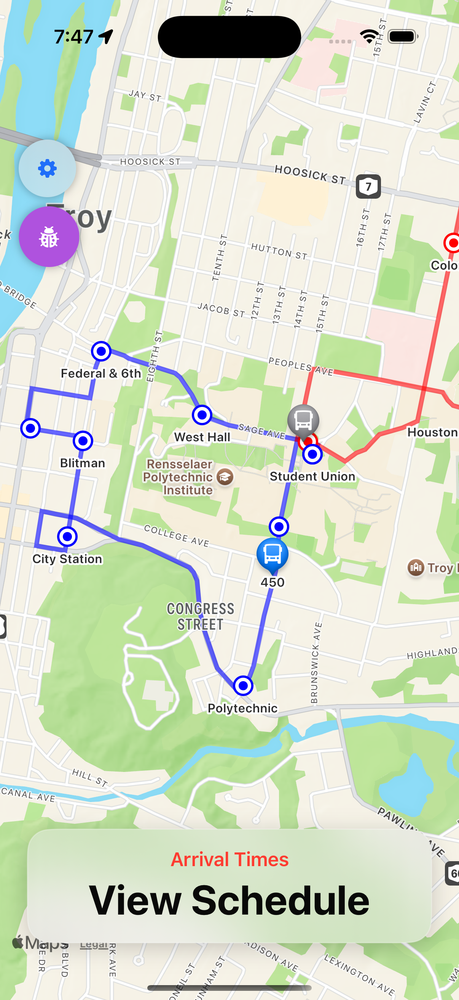
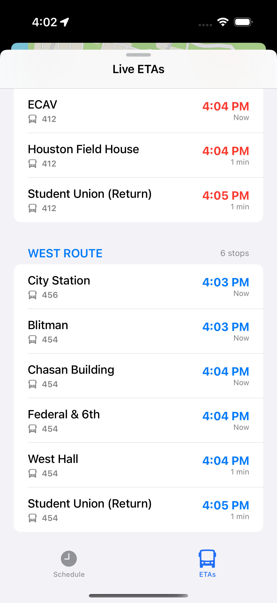
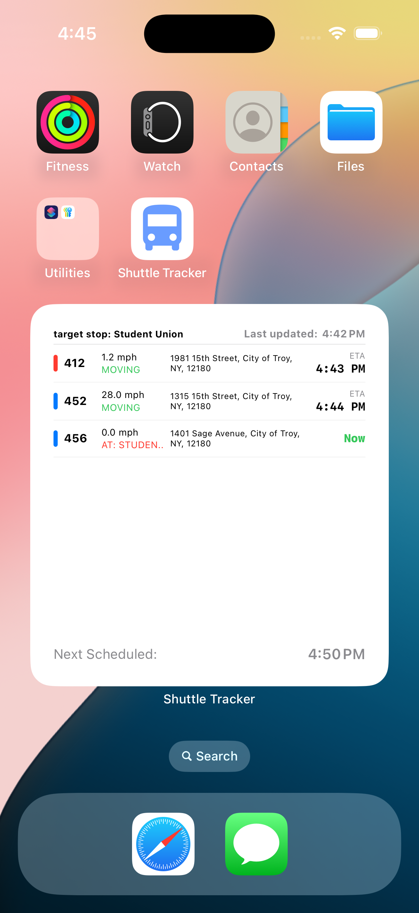

# TransitRadar-iOS

A SwiftUI application for tracking public transit and shuttle locations in real-time.

**Author:** Tuba Mirza

### Features
*   **Real-time Map:** View live locations of shuttles and transit vehicles.
*   **Route Information:** Detailed routes and stops for active lines.
*   **Schedules & ETAs:** Check estimated arrival times.
*   **iOS Widget:** Glanceable shuttle information right on your home screen.

  
   
  
  
  

### Architecture
- **MVVM Architecture**
- **Robust Networking with async/await**
- **Local Persistence and Caching**
